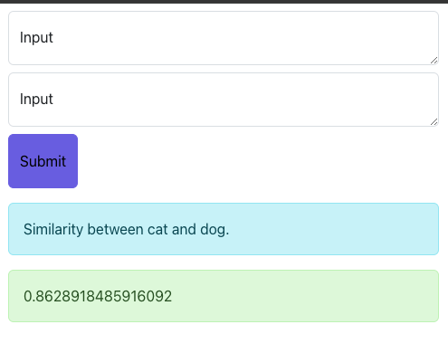
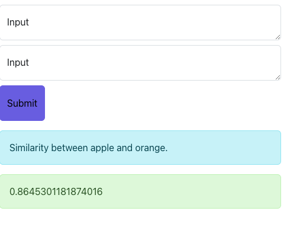

# Embedding Similarity Application

This project demonstrates how to compute the cosine similarity between the embeddings of two pieces of text using OpenAI's API. The application includes a frontend for user input, a backend to handle API requests, and utility functions for generating embeddings and calculating similarity.

## Table of Contents

- [Installation](#installation)
- [Usage](#usage)
- [API Endpoints](#api-endpoints)
- [Frontend](#frontend)
- [Examples](#examples)
- [License](#license)

## Installation

1. Clone the repository:
    ```bash
    git clone https://github.com/your-username/embedding-similarity.git
    cd embedding-similarity
    ```

2. Install the dependencies:
    ```bash
    npm install
    ```

3. Create a `.env` file in the root directory and add your OpenAI API key:
    ```env
    OPENAI_API_KEY=your_openai_api_key
    ```

## Usage

1. Start the server:
    ```bash
    npm start
    ```

2. Open your browser and navigate to `http://localhost:5001`.

## API Endpoints

### `POST /api/embedding`

This endpoint accepts two pieces of text and returns the cosine similarity between their embeddings.

**Request Body:**
```json
{
  "text1": "First piece of text",
  "text2": "Second piece of text"
}
```

**Response:**
```json
{
  "similarity": 0.85,
  "embedding1": [...],
  "embedding2": [...]
}
```

## Frontend

The frontend is a simple React application that allows users to input two pieces of text and see their similarity score.

### Code

```jsx
import React, { useState } from "react";
import "../style/style.css";

const Embedding = () => {
  const [wordOne, setWordOne] = useState("");
  const [wordTwo, setWordTwo] = useState("");
  const [result, setResult] = useState("");
  const [prompt, setPrompt] = useState("");
  const [responseok, setResponseok] = useState("");
  const [error, setError] = useState("");

  const handleSubmit = async (e) => {
    e.preventDefault();

    if (!wordOne) {
      setError("Please enter a prompt!");
      setPrompt("");
      setResult("");

      return;
    }

    const response = await fetch("/api/embedding", {
      method: "POST",
      headers: {
        "Content-Type": "application/json",
      },
      body: JSON.stringify({ text1: wordOne, text2: wordTwo }),
    });

    try {
      if (response.ok) {
        setResponseok(true);
        const data = await response.json();
        console.log(data);
        setPrompt(`Similarity between ${wordOne} and ${wordTwo}.`);
        setResult(data.similarity);
        setWordOne("");
        setWordTwo("");
        setError("");
      } else {
        setResponseok(false);
        throw new Error("An error occurred");
      }
    } catch (error) {
      console.log(error);
      setResult("");
      setError("An error occurred while submitting the form.", error);
    }
  };

  return (
    <div className="container">
      <form className="form-horizontal" onSubmit={handleSubmit}>
        <div className="form-group row">
          <div className="col-sm-5 mt-2">
            <div className="form-floating">
              <textarea
                className="form-control custom-input"
                id="floatingInput"
                placeholder="Enter a value"
                value={wordOne}
                onChange={(e) => setWordOne(e.target.value)}
              />
              <label htmlFor="floatingInput">Input</label>
            </div>
          </div>
          <div className="col-sm-5 mt-2">
            <div className="form-floating">
              <textarea
                className="form-control custom-input"
                id="floatingInput"
                placeholder="Enter a value"
                value={wordTwo}
                onChange={(e) => setWordTwo(e.target.value)}
              />
              <label htmlFor="floatingInput">Input</label>
            </div>
          </div>
          <div className="col-sm-2 mt-2">
            <button type="submit" className="btn btn-primary custom-button">
              Submit
            </button>
          </div>
        </div>
      </form>
      {error && <div className="alert alert-danger mt-3">{error}</div>}
      {prompt && <div className="alert alert-secondary mt-3">{prompt}</div>}
      {result && <div className="alert alert-success mt-3">{result}</div>}
    </div>
  );
};

export default Embedding;
```

## Examples

### Example 1



### Example 2



## License

This project is licensed under the MIT License. See the [LICENSE](LICENSE) file for details.